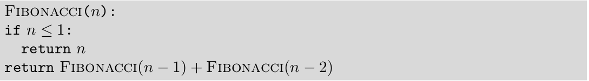
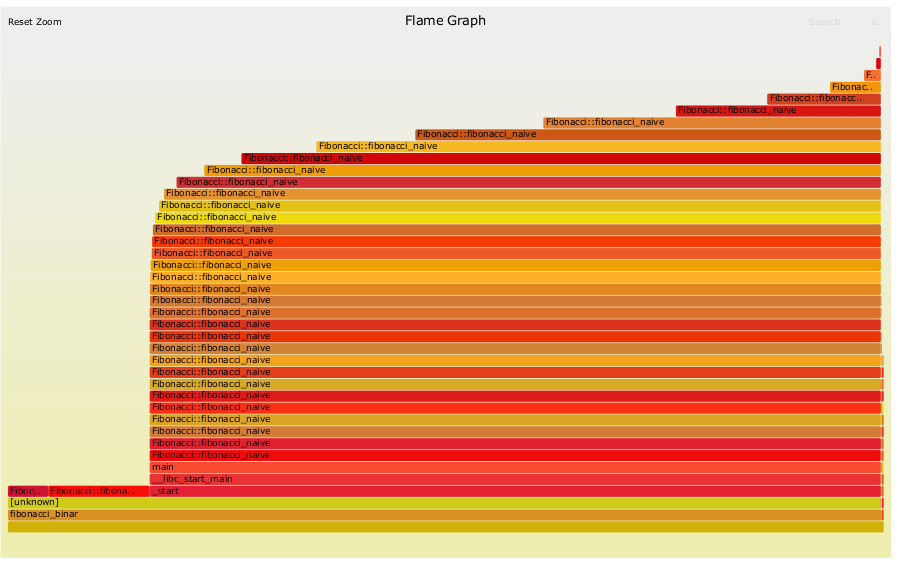

# linux-perf-tools
Perf is a performance analyzing tool in Linux.

Perf (Linux profiling with performance counter) is powerful: it can instrument CPU performance counters, tracepoints, kprobes, and uprobes (dynamic tracing). It is capable of lightweight profiling. It is also included in the Linux kernel, under tools/perf, and is frequently updated and enhanced.

perf began as a tool for using the performance counters subsystem in Linux, and has had various enhancements to add tracing capabilities.

## Section1: C++ application using perf

You may need to install `linux-tools-common` and other packages for the specific kernel:

```
sudo apt install linux-tools-common
```

```
linux-tools-4.15.0-88-generic
linux-cloud-tools-4.15.0-88-generic
```

### Optionally 

You may also want to install one of the following packages to keep up to date:

```
linux-tools-generic
Linux-cloud-tools-generic
```

### Perf analysis on C++ Fibonacci Number (Naive Algorithm)

The first approach to test Fibonacci number is using recursion and this will be indeed slow for greater value of n. 

Computing for n > 40 takes considerable time. 


<p align='center'>
    
Fig. 1 Pusedo code for Fibonacci number using recursion
</p>


In a new terminal type:

```
cd test-code-flame-graph
mkdir build
cd build
cmake ..
make
```
Binaries will be placed in build folder and this test had been done with following CMake settings:

```
cmake_minimum_required(VERSION 3.5.1)
project(test-code-flame-graph)
set(CMAKE_CXX_STANDARD 11)
set(CMAKE_CXX_FLAGS "${CMAKE_CXX_FLAGS} -std=gnu++11") 
```

### Creating a Perf.data for C++ Fibonacci Number

In a new terminal type:

```
sudo perf record --call-graph dwarf ./test-code-flame-graph
```

### Generating flameGraph from perf.data

In new separate terminal type:

```
sudo perf script | ./stackcollapse-perf.pl | ./famegraph.pl > perf.svg
```

### Generated flameGraph


<p align="left">
     

  <br/>
  Fig. 2 Generated flameGraph for Fibonacci number using recursion
</p>


## Section2: C++ shared library profiling using perf

Similarly, we can only profile C++ shared libraray using same way.

```
perf report -d library.so
```

### Generated flameGraph for shared library of C++ Fibonacci

<p align="left">
     

  <br/>
  Fig. 3 Generated flameGraph for C++ Fibonacci number shared library using recursion
</p>

## Section3: Python script with perf

In new separate terminal type:

```
git clone git@github.com:brendangregg/FlameGraph.git
```

```
cd FlaneGraph
python -m flamegraph -o perf.log myscript.py
```

This will generate a `perf.log` file in root folder of `FlameGraph`.

where `myscript.py` is supposed to be your python scripts which you wants to have analyze.


Now to run Brendan Gregg’s FlameGraph tool against the output:

```
flamegraph.pl --title "MyScript CPU" perf.log > perf.svg
```

Where `flamegraph.pl` is located in root folder of `FlameGraph`, the generated file `perf.svg`
will be saved in same root folder i.e. `FlameGraph`.

<p align="left">
     
   
  <br/>
  Fig. 4. CPU FlameGraph for myscript.py. Fig. 2. CPU FlameGraph for myscript.py
</p>


